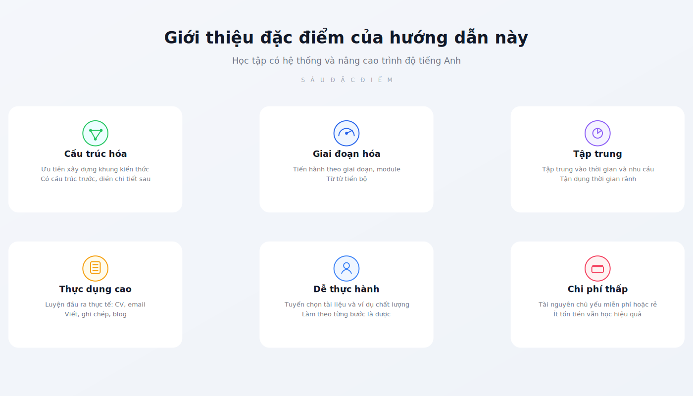
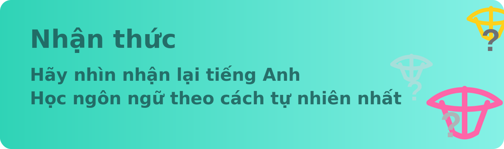
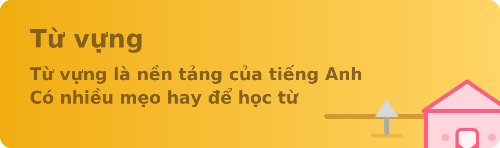
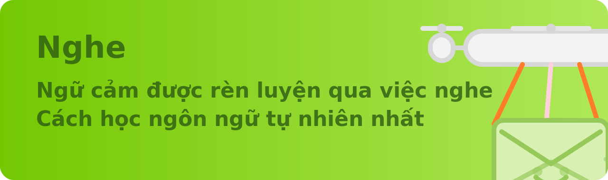
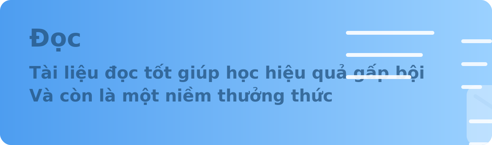
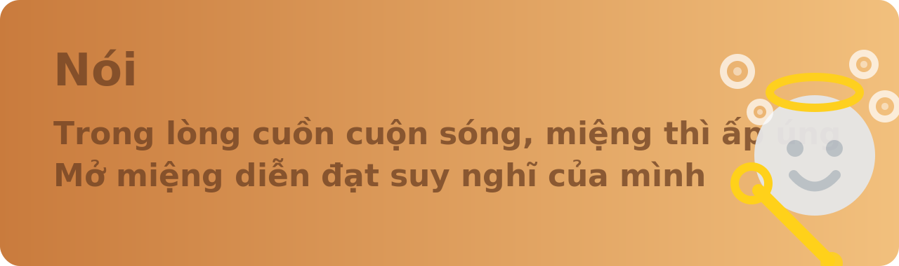
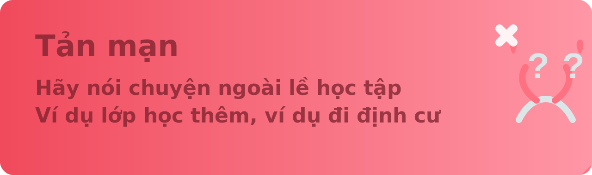

[`Tiếng Việt`](docs/README.md) | [`English`](docs/en/README.md)

Tặng riêng cho người tôi từng yêu thương nhất `W.`

> Mỗi người chúng ta đều sống trong quá khứ của riêng mình. Chỉ cần một phút để biết một người, một giờ để thích một người, một ngày để yêu một người — nhưng có thể cần cả đời để quên một người.

# Giới thiệu dự án

An advanced guide to learn English which might benefit you a lot.

[Cẩm nang nâng cao trình độ tiếng Anh](https://github.com/harperpets20-lang/English-level-up-tips).

## Bối cảnh

Xin chào bạn — chào mừng bạn đến với [Cẩm nang nâng cao trình độ tiếng Anh](https://github.com/harperpets20-lang/English-level-up-tips).

Khi ánh mắt bạn gặp những dòng chữ này, tôi chân thành hy vọng rằng đây không chỉ là một hành trình gian khó để chinh phục tiếng Anh, mà còn là một cuộc phiêu lưu kỳ diệu mở ra cánh cửa trí tuệ.

Quay lại đầu tháng 7 năm 2017, `W.` (đang chuẩn bị thi TOEFL) hỏi tôi một câu hỏi: **Làm sao để học tiếng Anh hiệu quả?**

Tôi thật lòng hy vọng mọi người có thể **yêu thích** việc học tiếng Anh. Nếu không thể, hãy thử tìm ra niềm vui hoặc lợi ích từ việc này.

The only way to do great work is to love what you do. If you haven't found it yet, keep looking. Don't settle. As with all matters of the heart, you'll know when you find it.

> > > Cách duy nhất để làm nên điều vĩ đại là yêu thích công việc của mình. Nếu bạn chưa tìm thấy, hãy tiếp tục tìm kiếm, đừng từ bỏ. Hãy lắng nghe trái tim mình, rồi một ngày bạn sẽ tìm thấy.

**Tình yêu đối với việc học**, cũng như vậy.

## Trình độ tiếng Anh

> Hình ảnh tham khảo chính từ [Global scale - Table 1 (CEFR 3.3): Common Reference levels](http://www.coe.int/en/web/common-european-framework-reference-languages/table-1-cefr-3.3-common-reference-levels-global-scale)

## Đặc điểm

## Các chương

Chương AI mới đã được cập nhật phiên bản `2026`, trọng tâm không còn chỉ là Prompt chung chung, mà là trả lời có hệ thống hơn:

- Tại sao bây giờ nên ưu tiên dùng `Gemini` làm công cụ học tiếng Anh chính
- Cách kết hợp `Gem / Live / Guided Learning / Canvas / quiz / flashcards` thành quy trình luyện tập hoàn chỉnh
- Ngoài Gemini, `ChatGPT / Claude / Perplexity / DeepL Write` nên phân công sử dụng như thế nào
- Cách thiết kế vòng lặp luyện tập nghe nói đọc viết thực sự hiệu quả lâu dài

Nếu bạn muốn biến AI thành máy tăng tốc học tiếng Anh thực sự, chứ không chỉ thỉnh thoảng nhờ dịch vài câu, chương này đáng đọc kỹ.

[Câu chuyện của tôi](docs/threads/part-2/my-story.md)

## Lời cảm ơn

- Cảm ơn tất cả những ai quan tâm và đóng góp cho cẩm nang này

## Câu chuyện cá nhân

Nếu bạn muốn biết bối cảnh cá nhân đằng sau cẩm nang này, hãy đọc [Câu chuyện của tôi](docs/threads/part-2/my-story.md).

## Đọc trực tuyến

- GitHub Pages: https://byoungd.github.io/English-level-up-tips/#/
- GitBook: https://babyyoung.gitbook.io/english-level-up-tips/

## Chuyển tải

Nếu bạn đăng lại cẩm nang này, xin vui lòng ghi rõ tác giả và đính kèm liên kết GitHub. Xin cảm ơn!

## Giấy phép

Tác phẩm này được cấp phép theo CC BY-NC 4.0.

## Lưu ý đặc biệt

Cẩm nang này không nhận quyên góp hay tài trợ.

Hãy dùng số tiền đó mua cho mình vài quyển sách hay.

    Học tập, chẳng phải là niềm vui tuyệt vời nhất trong đời sao?

> Cheers and Enjoy :)
